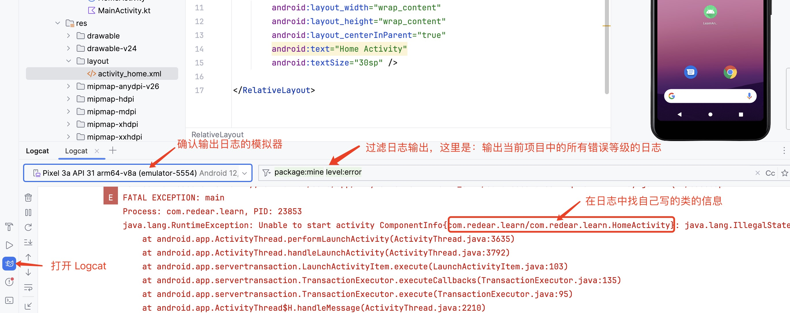

# 创建并运行你的第一个 Android 项目

注意：确保你已经安装 Android Studio 以及做好相关配置，包括不限于 Java 环境、创建模拟器。


## 新建项目

打开 Android Studio，选择 "New Project"，然后按图所标记进行选择


### 设置项目信息


注意：如果是首次创建项目，创建完成可能还需要等待一会。


### 创建第一个 Activity

Activity 就是你看到的页面，如果你是第一次接触现在可以理解一个页面就对应一个 Activity。

等待工程创建完成后，选中包名按图所示创建一个新 Activity


设置新 Activity 的 Name 为 HomeActivity，勾选 Lancher Activity，然后选择语言为 Java。


### 修改界面显示

打开 activity_home.xml，修改内容，界面只显示一个文本，文本显示 “Home Activity” 。


## 运行
选择好模拟器，点击运行按钮。


可以看到已经安装成功，但是实际效果是 app 打开后又回到了手机桌面，这个时候可能是代码有什么 bug 然后导致了应用闪退。


### 看日志，修改 bug

上面分析应该是出现了 bug，那么接下来就是怎么查看是什么 bug。


#### 如何通过查看日志，定位 bug 并修复它




可以看到完整的错误信息是下面这样的，就是要给 HomeActivity 设置 theme 为 Theme.AppCompat 或者是继承自 Theme.AppCompat。
```
java.lang.RuntimeException: Unable to start activity ComponentInfo{com.redear.learn/com.redear.learn.HomeActivity}: java.lang.IllegalStateException: You need to use a Theme.AppCompat theme (or descendant) with this activity.
```

#### 给 Activity 设置 Theme

打开 `AndroidManifest.xml` 文件，找到 `HomeActivity` 所在的 `<activity>` 标签，添加 `android:theme="@style/Theme.AppCompat"`，然后再次点击运行。


#### 再次运行

可以看到如下图所示预想的页面显示。


## 总结

以上完成了从创建项目到成功运行的整个流程，其中还包括了发生bug的时候如何通过日志定位 bug，以及根据错误提示进行修改 bug。


*有任何问题和想法可以留言或私信我～*